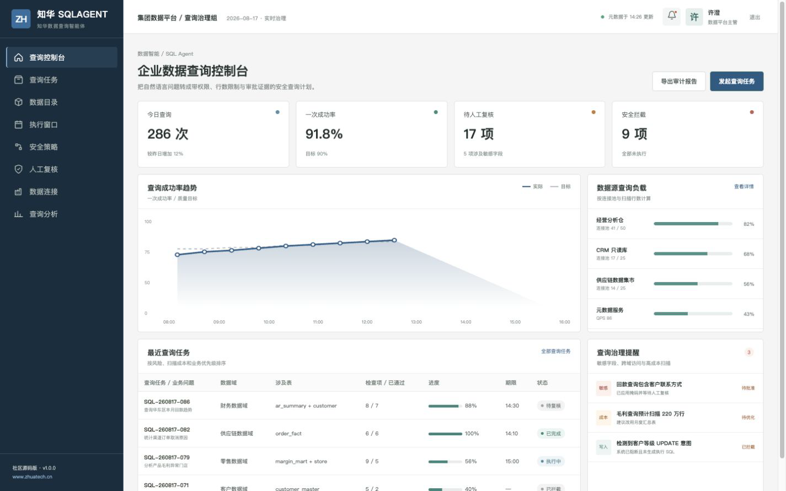
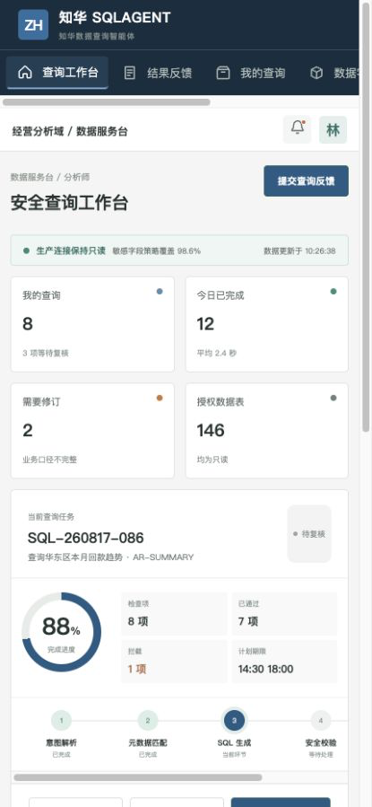

# ZhuaTech SQLAgent

企业数据查询智能体社区源码版：把自然语言问题转换为带权限门禁、扫描限制、SQL 预览和审计证据的安全查询计划。

[](backend/pom.xml) [](backend/pom.xml) [](frontend/package.json) [](compose.yaml) [](LICENSE)

由[知华科技（上海如静知华信息科技有限公司）](https://www.zhuatech.cn/)设计与维护。Java 根包为 `cn.zhuatech.sqlagent`。

## 控制面，而不只是 SQL 生成器

SQLAgent 将问题、候选表、预计扫描量、敏感数据和读写意图放进同一次决策。社区版用本地可测试规则生成 SQL 草案；写操作、非法表标识会直接阻断，敏感字段与大表扫描进入人工复核。



管理端用于维护数据连接、安全策略、查询队列和人工复核记录。



移动工作台适合分析师查看查询计划、数据字典、审批状态并反馈结果偏差。

### 已实现

- 自然语言查询任务和 SQL 安全计划接口 `POST /api/ai/sql/plan`
- 只读门禁、租户条件、敏感字段控制、扫描量分级和非法标识拦截
- JWT 岗位权限、管理端与响应式 H5 工作台
- MySQL + Flyway 数据版本，H2 自动化测试，Docker Compose 一键编排
- 不依赖外部大模型、不需要 API Key，便于本地学习和二次研究

## 本地体验

```bash
cd frontend
npm install
npm run dev:demo
```

打开 `http://localhost:5173`，可使用 `planner / Demo@2026` 进入治理端，或使用 `operator / Demo@2026` 进入分析师端。所有人物、数据源和查询记录均为虚构演示数据。

后端启动、数据库配置与接口示例见 [部署文档](deploy/README.md)、[API 文档](docs/api.md)和[架构说明](docs/architecture.md)。

## 使用边界

本工程仅能用于个人、非商业性的学习、研究和技术交流，**不得商用**。企业内部使用、生产部署、SaaS、项目交付、品牌替换、收费服务或二次销售，必须事先取得上海如静知华信息科技有限公司书面授权；完整条款见 [LICENSE](LICENSE)。

企业数据治理、自然语言查询、私有模型接入、OPC/业务系统集成、软件项目外包和深度定制，请访问[知华科技官网](https://www.zhuatech.cn/)或扫码咨询：

| 技术与方案咨询 | 商业授权及定制 |
| --- | --- |
|  |  |

关键词：企业 SQL Agent、自然语言查数、Text-to-SQL、数据治理、数据安全、Java AI 源码、知华科技、上海如静知华信息科技有限公司。

## 企业 SQL 执行策略

`POST /api/enterprise/sqlagent/execution-policy` 对真实候选 SQL 执行只读、单语句、表白名单、租户条件、敏感字段用途、扫描成本和结果行数门禁，返回放行、安全改写、人工复核或拒绝，并生成审计哈希。详见[SQL 执行策略说明](docs/ENTERPRISE_SQL_EXECUTION_POLICY.md)。

<!-- Copyright 2026 上海如静知华信息科技有限公司 -->
